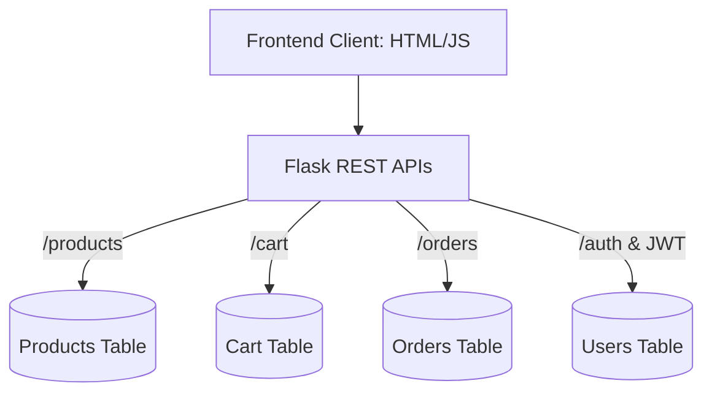

# E-Commerce Backend Platform 🚀

A scalable, decoupled RESTful E-Commerce backend built with **Pyhon Flask**, utilizing a **SQLAlchemy** database, secure **JWT Auth**, and a premium vanilla JS/CSS Frontend. 


## 🌟 Key Engineering Features

- **Microservice Mock Integration**: Includes simulated network latency and fail-rate handling for payment gateway simulation.
- **Stateless Authorization**: Protects Admin and user-specific endpoints via self-encoded JWTs passed through authorization HTTP headers.
- **Pagination & Search Filtering**: Built-in backend SQLAlchemy filters to efficiently retrieve thousands of products via `limit`, `page`, and `search` query parameters.
- **Visual Admin Interface**: Complete GUI for managing inventory, tracking stock reduction on checkout, and viewing order ledgers globally.
- **Architectural Scalability**: Organized using the Flask Factory Pattern and Blueprints, allowing effortless swapping of local SQLite data stores to live AWS MySQL instances.

---

## 🏗️ Architecture



## 🛠️ Stack Requirements
- Python 3.9+
- Flask (`Flask`, `Flask-SQLAlchemy`, `Flask-Bcrypt`)
- Authentication (`PyJWT`)
- Database connectivity (`mysql-connector-python`)

---

## 📥 Quick Start (Local Deployment)

Run this application seamlessly on any machine in 3 steps. Setting up an external MySQL database is NOT required for local testing (defaults to local `.db` file).

**1. Create a virtual environment and install dependencies**
```bash
python -m venv venv
.\venv\Scripts\activate   # (Windows)
source venv/bin/activate  # (Mac/Linux)
pip install -r requirements.txt
```

**2. Seed the Database**
Pre-populate the database with test products.
```bash
python fix.py
python seed_db.py
```

**3. Run the API Server**
```bash
python run.py
```
*Open `http://127.0.0.1:5000` in your web browser to test the full frontend!*

---

## 🔌 API Endpoints
| HTTP | Endpoint | Access | Description |
|---|---|---|---|
| POST | `/api/auth/register` | Public | Register new user. Supports `"role": "admin"` |
| POST | `/api/auth/login` | Public | Returns `token` for secured endpoints |
| GET | `/api/products/` | Public | Validates `?search=` and `?page=` params |
| POST/PUT | `/api/products/`| Admin | Add or edit price/stock of physical items |
| GET/POST | `/api/cart/` | Token | Retrieve/Add items against user session ID |
| POST | `/api/orders/` | Token | Execute simulated checkout & deplete stock |

#### Author
Eashwar Kancharla
